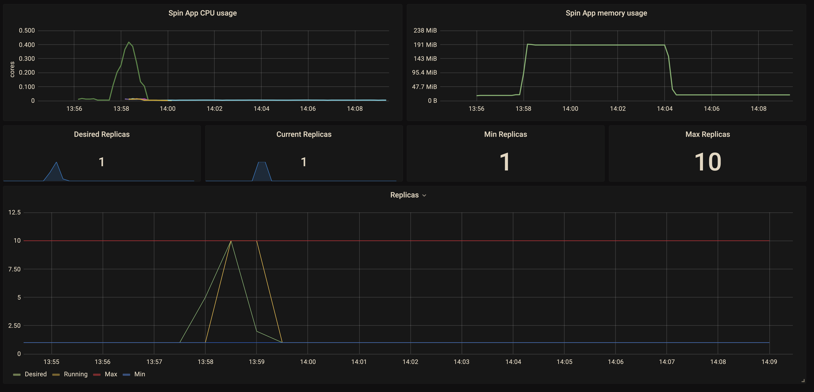

# SpinKube quickstart

[SpinKube](https://github.com/spinkube) is a new open source project that streamlines the experience of developing, deploying, and operating Wasm workloads on Kubernetes, using [Spin](https://github.com/fermyon/spin), the `[runwasi](https://github.containerd/runwasi)`, and [KWasm](https://kwasm.sh/) open source projects.

With SpinKube, you can leverage the advantages of using WebAssembly (Wasm) for your workloads:

- Artifacts are significantly smaller in size compared to container images.
- Artifacts can be quickly fetched over the network and started much faster (*Note: We are aware of several optimizations that still need to be implemented to enhance the startup time for workloads).
- Substantially fewer resources are required during idle times.

All of this while being able to integrate with with Kubernetes primitives (DNS, probes, autoscaling, metrics, and a lot more cloud native and CNCF projects).

## Prerequisites

### Spin

If you have not already done so, please [install](https://developer.fermyon.com/spin/v2/install) Spin. If you already have Spin installed, please [upgrade](https://developer.fermyon.com/spin/v2/upgrade) to the latest version.

### Spin k8s plugin

Please install [the `spin k8s` plugin](https://github.com/spinkube/spin-plugin-k8s).

### k3d

Please install [k3d](./prerequisites.md#k3d)

### kubectl

Please install [kubectl](./prerequisites.md#kubectl)

### Spin Operator

Clone the Spin Operator repository:

    ```bash
    $ git clone https://github.com/spinkube/spin-operator.git
    $ cd spin-operator
    ```

### Configuration

Follow the instructions on the [Spin Operator](https://github.com/spinkube/spin-operator) to configure your cluster, then install [the `spin k8s` plugin](https://github.com/spinkube/spin-plugin-k8s).

For a developer, the local experience of creating an application starts with `spin new`,
where they can use templates built by the community, or internal templates built by their
team.

You can [follow the the Spin quickstart here](https://developer.fermyon.com/spin/v2/quickstart).

Building your application, then running locally is done with `spin build`, and `spin up`:

```bash
$ spin new
$ spin build
$ spin up
```

> Note: the templates used can include additional objects for attaching things like Dapr
configuration, and the actual commands for building and running your app can be customized
(see this example).
> 

### Creating, distributing, and deploying a Spin application

> Note: clusters that do not yet support containerd >1.7.7, the fallback is to
continue to use the Dockerfile-based approach. We are working with the AKS team
to add support for this to the Azure Kubernetes Service.
> 

Spin applications are packaged as standalone artifacts and distributed using existing container registry infrastructure.

After building your Spin application, you can publish it to a registry using the `spin registry publish` command:

```bash
$ spin registry publish ttl.sh/hello-friends
spin registry push ttl.sh/hello-friends
Pushed with digest sha256:5c2e9e82039eadd7a4bca60941b01baf4fbabf3f92e61df589bba570d44960d6
```

We can now use the `spin k8s` command to scaffold the configuration to deploy the application on our cluster:

```yaml
$ spin k8s scaffold -f ttl.sh/hello-friends -o app.yaml

apiVersion: core.spinoperator.dev/v1
kind: SpinApp
metadata:
  name: hello-friends
spec:
  image: "ttl.sh/hello-friends"
  replicas: 2
```

This generated a simple Kubernetes manifest for an object of kind `SpinApp`, with the name of our Spin application, registry reference, and a default replica count of 2.

We can now apply our Kubernetes configuration to the cluster:

```bash
$ kubectl apply -f app.yaml
spinapp.core.spinoperator.dev/hello-friends created
```

This created our first `SpinApp` in the cluster, which we can inspect using `kubectl`:

```bash
$ kubectl get spinapps
NAME            READY REPLICAS   EXECUTOR
hello-friends   2                containerd-shim-spin
```

But what did this create? Let's have a look at the deployments, pods, and
services from our cluster:

```bash
$ kubectl get deployments
NAME            READY   UP-TO-DATE   AVAILABLE   AGE
hello-friends   2/2     2            2           4m53s

$ kubectl get services
NAME            TYPE        CLUSTER-IP     EXTERNAL-IP   PORT(S)         AGE
hello-friends   ClusterIP   10.43.166.18   <none>        80/TCP           5m

$ kubectl get pods
NAME                             READY   STATUS    RESTARTS   AGE
hello-friends-6b47d549c4-xksbk   1/1     Running   0          5m1s
hello-friends-6b47d549c4-tnlkj   1/1     Running   0          5m1s
```

This created standard Kubernetes deployments, pods, and services. The pod has the
`Runtime Class Name:  wasmtime-spin-v2` runtime class, and is using `runwasi` behind
the scenes to run the Spin application.

Because these are standard Kubernetes objects, you can do things like port-forwarding,
expose load balancer services, ingresses, or gateways.

Let's make sure the application is running. We can use `kubectl port-forward`, or the new
`spin k8s connect`, which forwards the application port locally and streams the logs:

```bash
$ spin k8s connect hello-friends -p 5555
connecting to pod default/hello-friends-74595f9f4b-tnkfs

Serving <http://0.0.0.0:80>
Available Routes:
  hello-zeiss: <http://0.0.0.0:80> (wildcard)
Forwarding from 127.0.0.1:5555 -> 80
Forwarding from [::1]:5555 -> 80
Handling request to Some(HeaderValue { inner: String("<http://localhost:5555/>") })
```

And we can now call our application endpoint locally:

```bash
$ curl localhost:5555
Hello, Internet friends!
```

### The `SpinApp` application manifest

The goal of the `SpinApp` manifest is twofold:

- to represent the possible options for configuring a Wasm workload running in Kubernetes
- to simplify and abstract the internals of *how* that Wasm workload is executed, while
allowing the user to configure it to their needs

As a result, the simplest `SpinApp` manifest only requires the registry reference to create a deployment, pod, and service with the right Wasm executor.

However, the `SpinApp` manifest currently supports configuring options such as:

- image pull secrets to fetch applications from private registries
- liveness and readiness probes
- resource limits (and requests*)
- Spin variables
- volume mounts
- autoscaling

### Autoscaling, monitoring

Let's create an application that can be used with a horizontal pod autoscaler:

```bash
$ kubectl apply -f hpa.yaml
spinapp.core.spinoperator.dev/hpa-spinapp created
horizontalpodautoscaler.autoscaling/spinapp-autoscaler created
```

We can now start a load test and watch the autoscaler kick in:

```bash
k get deployments -w
NAME          READY   UP-TO-DATE   AVAILABLE   AGE
hpa-spinapp   1/5     1            1           118s
hpa-spinapp   1/5     1            1           118s
hpa-spinapp   1/5     1            1           118s
hpa-spinapp   2/5     5            2           119s
hpa-spinapp   3/5     5            3           2m
hpa-spinapp   4/5     5            4           2m1s
hpa-spinapp   5/5     5            5           2m1s
hpa-spinapp   5/10    5            5           2m13s
hpa-spinapp   6/10    10           6           2m14s
hpa-spinapp   7/10    10           7           2m14s
hpa-spinapp   8/10    10           8           2m14s
hpa-spinapp   9/10    10           9           2m14s
hpa-spinapp   10/10   10           10          2m15s
hpa-spinapp   10/2    10           10          2m58s
hpa-spinapp   10/2    10           10          2m58s
hpa-spinapp   2/2     2            2           2m59s
hpa-spinapp   2/1     2            2           3m13s
hpa-spinapp   1/1     1            1           3m13s
```

With a dashboard configured (such as Grafana, or AppInsights), we can see the graphs for the resource utilization and replica count.

